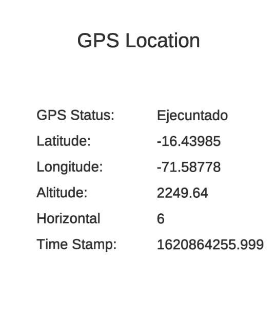

# GPS Location
El código del proyecto lo puedes encontrar [aquí](Assets/Scripts/GPS.cs)
<!--  -->
El objetivo de este ejemplo es extraer la latitud, longitud y amplitud del driver de nuestro dispositivo.

La siguiente imagen es un pantallazo del celular

No olviden dar permiso de GPS a la aplicación 

Gracias.